# 计算机图形学项目实验报告

## 项目介绍和实现结果

该项目主环境为一个迷宫。玩家以第一视角在穿越迷宫的时候，将出现许多怪物。玩家需要单击左键发射子弹射杀怪物，使自己能够安全到达迷宫出口找到圣火。若是被怪物碰到，则立刻死亡。

## 开发环境以及使用到的第三方库

- assimp
- freetype
- glew
- glfw
- glm

## 实现功能列表

### Basic

1. Camera Roaming
2. Simple lighting and shading
3. Texture mapping
4. Shadow mapping
5. Model import& Mesh viewing

### Bonus

1. Sky Box
2. Display Text
3. Complex Lighting
4. Collision Detection
5. Particle System
6. Fluid Simulation
7. Frame Animation

## 实现的功能点介绍 & 遇到的问题和解决方案（个人报告形式）

## 黄紫菱：

### Basic

#### Simple lighting and shading

1. 光照模型

   1. 新建了点光源这个类

   2. 环境光：

      ```c++
      ambientLight = lightColor * (intensity/4)
      ```

   3. 漫反射

      ```c++
      diffuseLight = vec3(dot(lightVector,NFragmentNormal))*lightColor*intensity/attenuation;
      ```

   4. 镜面反射

      ```c++
      reflected = reflect(-lightVector,NFragmentNormal);
      eyeDir = normalize(eyePos-NNFragmentPosition);
      spec = dot(reflected,eyeDir);
      specularLight = vec3(spec)*lightColor*intensity/attenuation;
      ```

   5. 光的衰弱

      ```c++
      0.2 +0.3 * lightDistance +0.4 * lightDistance * lightDistance;
      ```


#### model import & mesh viewing

1. md2model

   1. 顶点结构

      ```c++
      struct {  
      	BYTE vertex[3]; //顶点坐标 
      	BYTE normalIndex; //顶点的法向量
       }
      ```

   2. 每一帧的顶点解压

      ```c++
      x = 缩放比例 * v[0] + 偏移量 
      y = 缩放比例 * v[1] + 偏移量 
      z = 缩放比例 * v[2] + 偏移量
      normal = normalIndex;
      ```


### Bonus

#### sky box

1. 创建了立方体的类，类中包含
   1. GameObjectPtr cube：物体的最基本的类
   2. 立方体的顶点信息
   3. 立方体的面的信息
2. 创建了立方体纹理的类，类中包含
   1. 纹理的相关信息
   2. 绑定纹理信息的函数
3. 实现了天空盒的类，类中包含
   1. cube
   2. texture cube
   3. 构造函数
      1. 设置立方体的大小
      2. 将立方体的纹理贴图分别加入立方体纹理的类里面
   4. 设置着色器
      1. 顶点着色器：
         1. 将输入的位置向量作为片段着色器的纹理坐标
         2. 顶点位置=MVP*vec4(position,1)
      2. 片段着色器
         1. color = texture(skybox, TexCoord);
   5. 渲染
      1. 绑定纹理
      2. 渲染、绘制立方体


#### display text


#### collision detection

1. AABB碰撞
   1. 原理是判断两个物体的碰撞盒是否有重合的地方
   2. 即判断两物体的碰撞盒区域的pos的x和z分量是否是交叉的
2. 涉及的碰撞
   1. 角色和墙壁的碰撞
   2. 怪物和墙壁的碰撞
   3. 烟和墙壁的碰撞
   4. 子弹和怪物的碰撞
   5. 人和终点的碰撞
3. 优化
   1. 由于地图元素过多，对于碰撞问题需要检测很多次，这里使用了字符串数组存地图的方式，通过所在位置对应地图的字符串的值，判断是否在墙壁的区域来节省检测的时间
   2. 每次碰撞检测的时候都用现在的位置的x和z值访问字符串数组，获得该位置的情况，判断是否发生碰撞。

#### particle system

1. 实现了粒子类
   1. 粒子属性
      1. 运动方向
      2. 旋转
      3. 开始大小
      4. 最后大小
      5. 开始颜色
      6. 最后颜色
      7. 最大生命值
      8. 重力
      9. 纹理
   2. 更新函数
      1. 位置：随运动方向和重力作用影响
      2. 旋转角度：随旋转速度影响
      3. 大小：由开始大小到最后大小进行线性差值
      4. 颜色：由开始颜色到最后颜色进行线性差值
      5. 生命值减少
   3. 获取是否死亡
      1. 当生命值减到小于等于0时返回true
2. 实现粒子管理类
   1. 初始化：初始化粒子池的粒子、设置顶点数据、设置着色器
   2. 增加粒子：在获取闲置粒子，调用加入活跃池函数
   3. 更新函数
      1. 在活跃粒子池中寻找每一个粒子，将其纹理信息加到纹理库中
      2. 调用每个粒子的更新函数
      3. 判断当粒子死亡或者撞墙的时候，设置需要回收的粒子+1
   4. 回收函数
      1. 遍历活跃粒子池里的每一个粒子，当粒子处于死亡状态或者撞墙的时候，将后一个粒子的值赋给前一个粒子（即删掉这个粒子）
   5. 渲染函数
      1. 绑定纹理：确保第一个纹理单元时我们绑定的
      2. 设置着色器
      3. 绘出粒子
   6. 加入到活跃池
      1. 找到加入的粒子的索引
      2. 在该所引出插入这个粒子
      3. 活跃池粒子数+1
   7. 获取闲置粒子
      1. 取闲置池里最后一个粒子
      2. 从活跃池里选择应该被闲置的粒子

#### Frame animation


#### Load Map

1. 这里使用了字符串数组存地图的方式
   1. 文件的格式
      1. 首先将地图的大小（x 和 y）填入第一行和第二行（这里直接设置了20 和 20）
      2. 第三行开始打地图，如果该处是墙壁就用“#”表示，如果是空的就用“ ” 表示
   2. 读取文件
      1. 先读取两行关于地图大小的信息
      2. 再按行读取，将字符存到字符串数组中
   3. 字符串数组转地图
      1. 遍历上一步获得的字符串数组，将字符串数组中为“#”的部分的位置 ($x_i$,1,$y_0$) 存到数组中，为“#”则存的位置是0
      2. 在渲染、绘制的过程中，将偏移值数组作为位置传入着色器中
      3. 模型的顶点着色器：在传入的位置+相应ID的偏移值作为真实的位置

### 遇到的问题和解决方案

1. 摄像机穿模
   1. 由于主角的碰撞盒小，因此当判断到与墙壁发生碰撞的时候，摄像机已经能看到模型内部的东西了
   2. 解决方案是在检测角色是否和墙壁碰撞的时候，讲主角的碰撞盒调大一些，
2. 碰撞检测所需时间过长
   1. 我们打算寻找能够缩短碰撞检测所需要的时间的方法，后来在别人的博客中看到了使用字符串记录地图信息，将字符串数组转换成地图，再通过字符串数组判断是否碰撞的想法，想到通过这种方法就能节省很多用来判断碰撞的时间，因此我们就参考了他的方法。虽然这么做准确度可能有点低，即不能精准到真实接触墙壁。
   2. 同时，在参考了这一想法后，我们也参考了他的文件组成，即，抽离出一些基本的类，例如mesh、几何图形等，而不是直接在处理一些逻辑问题例如碰撞、运动等的代码和处理顶点信息等放到同一个文件中，从而重构了代码结构。

## 王泽浩

### Bonus

#### Complex Lighting （Normal Mapping）

为了让场景中的物体表面细节更加丰富，提升真实感，参照教程实现了法线贴图，使组成迷宫的砖块表面显示出细小的空洞。

具体做法是添加一个 2D 纹理贴图来存储法线向量，将法线向量的 x、y、z 元素储存到纹理中，代替颜色的 r、g、b元素。注意法线向量的范围在-1到1之间，所以先要将其映射到0到1的范围：

```c++
// Model.fragmentshader
uniform sampler2D NrmSampler;
uniform int hasNormals;
...
    
if(hasNormals == 1){
    // 从法线贴图范围[0,1]获取法线
    vec4 encodedNormal = texture2D(NrmSampler, fragmentTXC);
    // 将法线向量转换为范围[-1,1]
    vec3 localCoords = 2.0 * encodedNormal.rgb - vec3(1.0);
    
    [...]
    // 像往常那样处理光照
}
...
```

一般的法线贴图是一种偏蓝色调的纹理，是因为所有法线的指向都偏向z轴（0, 0, 1）这是一种偏蓝的颜色。对于一个简单的朝向正z轴的平面上，使用按照上述方式进行光照的计算没有问题，但对于一个6面立方体的话，我们就需要6个法线贴图，但是这不太方便，一种解决办法是定义法线空间，法线贴图中的法线向量在切线空间中，法线永远指着正z方向。然后计算出一种矩阵，把法线从切线空间变换到一个不同的空间，这样它们就能和表面法线方向对齐了：法线向量都会指向正y方向。

这种矩阵叫做TBN矩阵这三个字母分别代表tangent、bitangent和normal向量。已知上向量是表面的法线向量。右和前向量是切线(Tagent)和副切线(Bitangent)向量。下面的图片展示了一个表面的三个向量：


这里没有使用手工计算这些切线和副切线向量，而是在模型加载器中实现了一次就行了：**使用了Assimp的那个加载器中实现的。**

Assimp 有个很有用的配置，在我们加载模型的时候调用 aiProcess_CalcTangentSpace。当aiProcess_CalcTangentSpace 应用到 Assimp的ReadFile 函数时，Assimp 会为每个加载的顶点计算出柔和的切线和副切线向量，和教程中手工计算的过程类似。

```c++
// Helper.cpp
Assimp::Importer importer;

const aiScene* scene = importer.ReadFile(path.c_str(),aiProcess_Triangulate|aiProcess_GenSmoothNormals|aiProcess_GenUVCoords|aiProcess_CalcTangentSpace);

scene = importer.ApplyPostProcessing(aiProcess_CalcTangentSpace);

if(!scene){
    cout<<"ERROR LOADING MESH: "<<path<<endl;
    return nullptr;
}

// 加载 mesh
for(int i=0;i<scene->mNumMeshes;i++){
  	...
	// 加载顶点数据
    for(unsigned int i=0;i<mesh->mNumVertices;i++){
		// 顶点坐标
        const aiVector3D* pPos = &(mesh->mVertices[i]);
        // 顶点法线向量
        const aiVector3D* pNormal = mesh->HasNormals()? &(mesh->mNormals[i]):&Zero3D;
        // 顶点 color
        const aiColor4D* pColor =mesh->HasVertexColors(0)? (mesh->mColors[i]):&EmptyColor;
        // 顶点纹理坐标
        const aiVector3D* pTexCoord = mesh->HasTextureCoords(0)? &(mesh->mTextureCoords[0][i]):&Zero3D;
        // 获取计算出来的切线向量
        const aiVector3D* pTangent = mesh->HasTangentsAndBitangents()? &(mesh->mTangents[i]):&Zero3D;

        //cout<<pTangent->x<<" | "<<pTangent->y<<" | "<<pTangent->z<<endl;

        glm::vec3 pos = glm::vec3(pPos->x,pPos->y,pPos->z);
        glm::vec3 norm = glm::vec3(pNormal->x,pNormal->y,pNormal->z);
        glm::vec3 col = glm::vec3(pColor->r,pColor->g,pColor->b);
        glm::vec2 tex = glm::vec2(pTexCoord->x,pTexCoord->y);
        glm::vec3 tan = glm::vec3(pTangent->x,pTangent->y,pTangent->z);

        meshGEO->pushVertex(Vertex(pos,col,tex,norm,tan));
    }
    ...
```

然后将法线和切线向量传给顶点着色器，作为它的属性：

```c++
#version 330 core

layout(location = 0) in vec3 position;
layout(location = 1) in vec3 color;
layout(location = 2) in vec3 normal;
layout(location = 3) in vec2 texCoord;
layout(location = 4) in vec3 tangent;
```

在顶点着色器的 main 函数中我们创建 TBN 矩阵：

```c++
// 转换到世界坐标系中
// T
localSurface2World[0] = normalize(vec3(ModelMatrix * vec4(tangent, 0.0)));
// N
localSurface2World[2] = normalize(ibMat * normal);
// B
localSurface2World[1] = normalize(cross(localSurface2World[2], localSurface2World[0]));
```

把 TBN 传给像素着色器，用切线空间的法线乘以这个 TBN 矩阵，将法线向量变换到和其他光照向量一样的参考空间中。

```c++
// Model.fragmentshader
uniform sampler2D NrmSampler;
uniform int hasNormals;
...
    
if(hasNormals == 1){
    // 从法线贴图范围[0,1]获取法线
    vec4 encodedNormal = texture2D(NrmSampler, fragmentTXC);
    // 将法线向量转换为范围[-1,1]
    vec3 localCoords = 2.0 * encodedNormal.rgb - vec3(1.0);
    
    // 引入切线到世界空间变换
    NFragmentNormal = normalize(localSurface2World * localCoords);
    [...]
    // 像往常那样处理光照
}
...
```

因为最后的 normal 现在在世界空间中了，就不用改变其他像素着色器的代码了，因为光照代码就是假设法线向量在世界空间中。

效果如下：

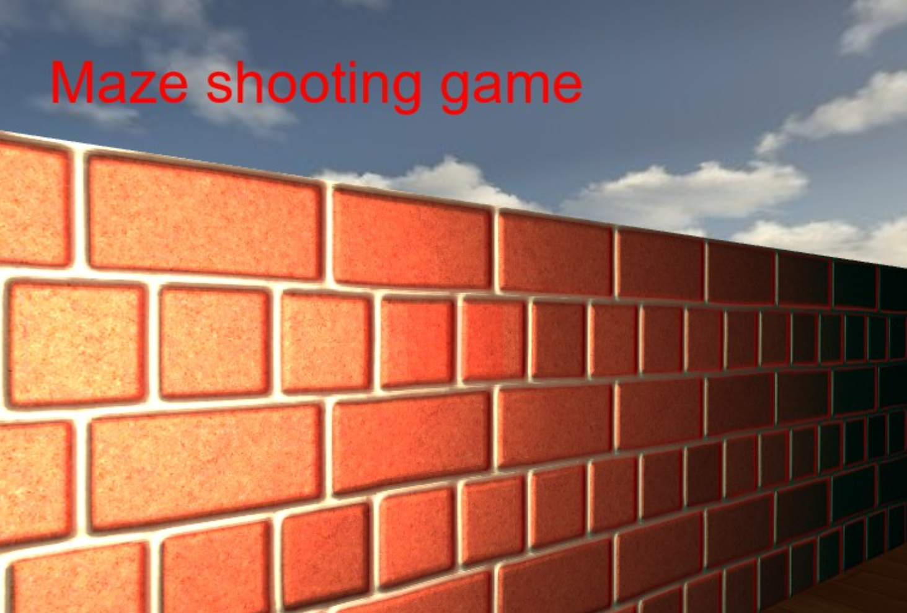

#### Blending

射击的瞄准准心使用 Blending，混合(Blending)通常是实现物体透明度(Transparency)的一种技术。

一个物体的透明度是通过它颜色的aplha值来决定的。Alpha颜色值是颜色向量的第四个分量，当alpha值为0.0时物体将会是完全透明的。

首先加载带有内嵌的alpha通道的纹理，即每个纹素(Texel)都包含了一个alpha值。

```c++
// Game.cpp
void Game::setupCenter(){
    unsigned char *data = stbi_load("../res/textures/center.png", &width, &height, &nrComponents, 0);
    if (data)
    {
        GLenum format;
        if (nrComponents == 1)
            format = GL_RED;
        else if (nrComponents == 3)
            format = GL_RGB;
        // 通道数为 4
        else if (nrComponents == 4)
            format = GL_RGBA;

        glActiveTexture(GL_TEXTURE0);
        glBindTexture(GL_TEXTURE_2D, _texture);
        glTexImage2D(GL_TEXTURE_2D, 0, format, width, height, 0, format, GL_UNSIGNED_BYTE, data);
        glGenerateMipmap(GL_TEXTURE_2D);
}
```

然后在渲染准心前启用混合，并设定相应的混合函数：

```c++
// Game.cpp
// draw aiming cente
glEnable(GL_BLEND);
glBlendFunc(GL_SRC_ALPHA, GL_ONE_MINUS_SRC_ALPHA);

glBindVertexArray(_VAO);
glDrawArrays(GL_TRIANGLES, 0, 6);

glDisable(GL_BLEND);
```

效果如下：

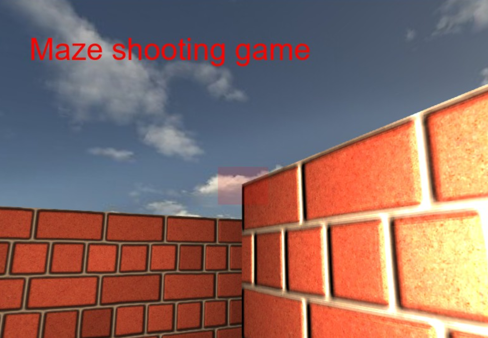

#### 射击操作

新建 Bullet 类，每个子弹为一个 cube，保存子弹的 VAO，VBO，位置，方向，速度等属性。

BulletManager 负责管理 vector<Bullet*> bulletLists，进行子弹的生成，渲染和销毁。

添加鼠标点击事件监听，左键点击时触发子弹发射

```c++
void Game::handleMouseButtons(GLFWwindow* window,int button,int action,int mods){
	if (action == GLFW_PRESS) {
		switch (button)
		{
		case GLFW_MOUSE_BUTTON_LEFT:
			std::cout<<"GLFW_MOUSE_BUTTON_LEFT Event"<<std::endl;
            // 传入发射方向和玩家位置，生成新的 bullet 到 bulletLists 中
			bulletManager->newBullet(-camera.getLookDirection(), playerLight.position);
			break;
		default:
			break;
		}
	}
}
```

使用 AABB 的碰撞检测函数，当碰撞到怪物时子弹销毁。

```c++
bool BulletManager::Collide(glm::vec3 pos) {
	for (auto it = bulletLists.begin(); it != bulletLists.end();) {
		float x = (*it)->getPosition().x;
		float y = (*it)->getPosition().z;
		if (x >= (pos.x - 0.4) && x <= (pos.x + 0.4) && y >= (pos.z - 0.4) && y <= (pos.z + 0.4)) {
            // 销毁子弹
			it = bulletLists.erase(it);
			return true;
		}
		else {
			it++;
		}
	}
	return false;
}
```

未发生碰撞的在渲染时判断是否与玩家的距离超过一定大小，若是则销毁。

```c++
void BulletManager::render(const glm::vec3 &lightPos, EulerCamera camera) {
	for (int i = 0; i < (int)this->bulletLists.size(); i++) {
        float distance = glm::distance(bulletLists[i]->getPosition(), camera.getPosition());
	    if (distance > 100){
		    deleteBullet(bulletLists[i]->id);
        }else{
		    bulletLists[i]->render(lightPos, camera);
        }
	}
}
```

效果如下：

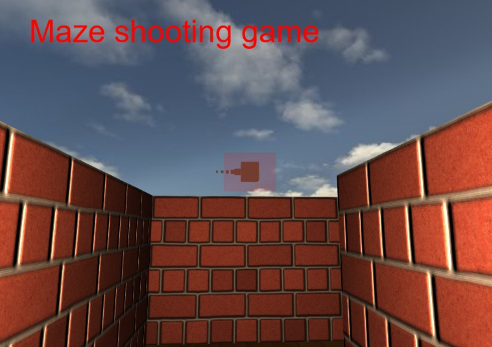

### 遇到的问题

1. 在进行渲染准心时需要 glEnable(GL_BLEND)，保证当渲染了一个片段时，它都会将当前片段的颜色和当前颜色缓冲中的片段颜色根据 alpha 值来进行混合。

2. 在渲染子弹时，需要将子弹按当前 yaw, pitch 旋转，使得射出子弹时只看到它的尾部

   ```c++
   void Bullet::render(const glm::vec3 &lightPos, EulerCamera camera) {
   	// don't forget to enable shader before setting uniforms
   	this->shader->bind();
   
   	// view/projection transformations
   	glm::mat4 projection = camera.getProjectionMatrix();
   	glm::mat4 view = camera.getViewMatrix();
   	this->shader->setUniform("projection", projection);
   	this->shader->setUniform("view", view);
   
   	glm::mat4 model = glm::mat4(1.0f);
   	this->position = this->position + this->front * Bullet::velocity;
   	model = glm::translate(model, this->position);
   	model = glm::scale(model, glm::vec3(0.05f, 0.05f, 0.05f));
   	// 子弹按当前yaw, pitch旋转，使得射出子弹时只看到它的尾部
   	model = glm::rotate(model, glm::radians(camera.getYaw()), glm::vec3(0.0f, 1.0f, 0.0f));
   	model = glm::rotate(model, glm::radians(camera.getPitch()), glm::vec3(0.0f, 0.0f, 1.0f));
   	this->shader->setUniform("model", model);
   
   	// 光照设置
   	float ambientStrength = 0.5f;
   	float diffuseStrength = 1.0f;
   	float specularStrength = 0.8f;
   	int shininess = 64;
   	this->shader->setUniform("ambientStrength", ambientStrength);
   	this->shader->setUniform("diffuseStrength", diffuseStrength);
   	this->shader->setUniform("specularStrength", specularStrength);
   	this->shader->setUniform("shininess", shininess);
   	this->shader->setUniform("lightColor", glm::vec3(1.0f, 1.0f, 1.0f));
   	this->shader->setUniform("lightPos", lightPos);
   	this->shader->setUniform("viewPos", camera.getPosition());
   
   	glBindVertexArray(VAO);
   	glDrawArrays(GL_TRIANGLES, 0, 36);
   	glBindVertexArray(0);
   }
   
   ```

3. 在设置子弹的方向时，注意与摄像机指向的方向相反：-camera.getLookDirection()

## 王雁玲

### Basic

#### Camera Roaming

直接使用之前作业实现的camera类

- 设定camera的 pos，up，front

- 前后左右移动：对camera pos进行修改

  ```c++
  void Camera::moveForward(GLfloat const distance) {
  	cameraPos += distance * cameraFront;
  	sendToShader();
  }
  void Camera::moveBack(GLfloat const distance) {
  	cameraPos -= distance * cameraFront;
  	sendToShader();
  }
  void Camera::moveRight(GLfloat const distance) {
  	cameraPos += glm::normalize(glm::cross(cameraFront, cameraUp)) * distance;
  	sendToShader();
  }
  void Camera::moveLeft(GLfloat const distance) {
  	cameraPos -= glm::normalize(glm::cross(cameraFront, cameraUp)) * distance;
  	sendToShader();
  }
  ```

- look around 效果：改变摄像机的朝向向量（cameraFront）

  首先鼠标获取差值，计算出 pitch 和 yaw 或者直接使用 xoffset， yoffset。然后使用欧拉法，使用yaw，pitch和 球坐标系求出坐标即可。

  ```c++
  void Camera::rotate(GLfloat const pitch, GLfloat const yaw) {
  	glm::vec3 front;
  	front.x = cos(glm::radians(pitch)) * cos(glm::radians(yaw));
  	front.y = sin(glm::radians(pitch));
  	front.z = cos(glm::radians(pitch)) * sin(glm::radians(yaw));
  	cameraFront = glm::normalize(front);
  
  	sendToShader();
  }
  ```

#### Texture Mapping

- 创建、绑定纹理

  ```c++
  GLuint texture;
  glGenTextures(1, &texture);
  glBindTexture(GL_TEXTURE_2D, texture);
  ```

- 载入图片

  ```c++
  int width, height;
  unsigned char* image = SOIL_load_image("wood.jpg", &width, &height, 0, SOIL_LOAD_RGB);
  glTexImage2D(GL_TEXTURE_2D, 0, GL_RGB, width, height, 0, GL_RGB, GL_UNSIGNED_BYTE, image);
  glGenerateMipmap(GL_TEXTURE_2D);
  SOIL_free_image_data(image);
  glBindTexture(GL_TEXTURE_2D, 0); 
  ```

- 着色器设置

  采样器(Sampler)是GLSL里的供纹理对象使用的内建数据类型，它以纹理类型作为后缀。

  对于2D贴图，我们可以设置片段着色器如下：

  ```c++
  #version 330 core
  in vec3 ourColor;
  in vec2 TexCoord;
  
  out vec4 color;
  
  uniform sampler2D ourTexture;
  
  void main()
  {
      color = texture(ourTexture, TexCoord);
  }
  ```

#### Shadow Mapping

- 以光源的视角渲染场景，得到深度图

  - 计算变换矩阵

    首先，我们与之前做摄像机类似，先根据光源所在的位置，指向的方向以及一个向上的向量计算出view变换矩阵。

    ```c++
    lightView = glm::lookAt(lightPos, glm::vec3(0.0f), glm::vec3(0.0, 1.0, 0.0));
    ```

    选择投影方式，计算出投影矩阵。这里暂时使用正交投影

    ```c++
    lightProjection = glm::ortho(-10.0f, 10.0f, -10.0f, 10.0f, near_plane, far_plane);
    ```

    两个矩阵相乘，得到一个将坐标从世界坐标系变换到光源视角的坐标系的矩阵

    ```c++
    lightSpaceMatrix = lightProjection * lightView;
    ```

  - 生成深度图

    为渲染的深度贴图创建一个帧缓冲对象

    ```c++
    unsigned int depthMapFBO;
    glGenFramebuffers(1, &depthMapFBO);
    ```

    创建2D纹理

    ```c++
    unsigned int depthMap;
    glGenTextures(1, &depthMap);
    glBindTexture(GL_TEXTURE_2D, depthMap);
    
    // 只关心深度值，所以把纹理格式设置为GL_DEPTH_COMPONENT
    glTexImage2D(GL_TEXTURE_2D, 0, GL_DEPTH_COMPONENT, SHADOW_WIDTH, SHADOW_HEIGHT, 0, GL_DEPTH_COMPONENT, GL_FLOAT, NULL);
    glTexParameteri(GL_TEXTURE_2D, GL_TEXTURE_MIN_FILTER, GL_NEAREST);
    glTexParameteri(GL_TEXTURE_2D, GL_TEXTURE_MAG_FILTER, GL_NEAREST);
    glTexParameteri(GL_TEXTURE_2D, GL_TEXTURE_WRAP_S, GL_CLAMP_TO_BORDER);
    glTexParameteri(GL_TEXTURE_2D, GL_TEXTURE_WRAP_T, GL_CLAMP_TO_BORDER);
    GLfloat borderColor[] = { 1.0, 1.0, 1.0, 1.0 };
    glTexParameterfv(GL_TEXTURE_2D, GL_TEXTURE_BORDER_COLOR, borderColor);
    
    // 绑定buffer
    glBindFramebuffer(GL_FRAMEBUFFER, depthMapFBO);
    glFramebufferTexture2D(GL_FRAMEBUFFER, GL_DEPTH_ATTACHMENT, GL_TEXTURE_2D, depthMap, 0);
    glDrawBuffer(GL_NONE); // 不使用颜色数据进行渲染
    glReadBuffer(GL_NONE);
    glBindFramebuffer(GL_FRAMEBUFFER, 0);
    ```

  - 使用深度图渲染场景

    ```c++
    glViewport(0, 0, SHADOW_WIDTH, SHADOW_HEIGHT);
    glBindFramebuffer(GL_FRAMEBUFFER, depthMapFBO);
    glClear(GL_DEPTH_BUFFER_BIT);
    renderScene(simpleDepthShader);
    ```

- 以camera视角渲染场景，使用Shadowing Mapping算法(比较当前深度值与在DepthMap Texture的深度值)，决定某个点是否在阴影下。

  检查片元是否在阴影下。该步骤在着色器下进行。

   ① 在顶点着色器中，利用之前算出来的变换矩阵将顶点转换到光空间

  ```c++
   vs_out.FragPosLightSpace = lightSpaceMatrix * vec4(vs_out.FragPos, 1.0);
  ```

   ② 在片段着色器中，通过判断片元深度值与texture存储的深度值的大小关系，决定渲染的颜色。

   透视除法

  ```c++
   vec3 projCoords = fragPosLightSpace.xyz / fragPosLightSpace.w;
  ```

    将片元深度变换到[0,1]之间

  ```c++
   projCoords = projCoords * 0.5 + 0.5;
  ```

     比较深度

  ```c++
   float closestDepth = texture(shadowMap, projCoords.xy).r;
   float currentDepth = projCoords.z;
   shadow = currentDepth  > closestDepth ? 1.0 : 0.0;
  ```

    计算渲染的颜色

  ```c++
   vec3 lighting = (ambient + (1.0 - shadow) * (diffuse + specular)) * color;
  ```

  效果

  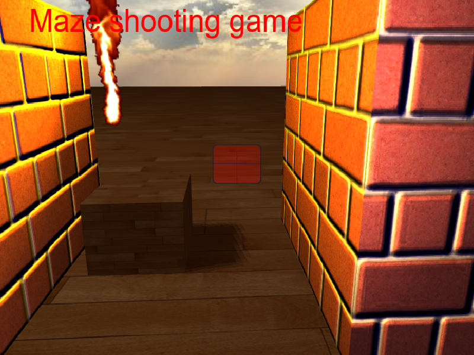

### Bonus

#### Display Text

这部分参照了Learnopengl的教程实现。

我们使用 FreeType 这个库。FreeType 所做的事就是加载 TrueType 字体并为每一个字形**生成位图**以及**计算几个度量值**。

- 位图 -> 生成字形的纹理数据

  - 加载面。将FT_LOAD_RENDER设为加载标记之一，FreeType会创建一个8位的灰度图。可以通过face->glyph->bitmap来访问这个位图。

    ```c++
     FT_Load_Char(face, c, FT_LOAD_RENDER)
    ```

  - 生成纹理

    ```c++
    glTexImage2D(GL_TEXTURE_2D, 0, GL_RED, face->glyph->bitmap.width, face->glyph->bitmap.rows, 0, GL_RED, GL_UNSIGNED_BYTE, face->glyph->bitmap.buffer);
    }
    ```

    通过字形生成的位图是一个8位的灰度图，所以我们只使用GL_RED（一个字节）的储存形式即可。

    **需要注意要禁用字节对齐限制**

    > OpenGL要求所有的纹理都是4字节对齐的，即纹理的大小永远是4字节的倍数。通常这并不会出现什么问题，因为大部分纹理的宽度都为4的倍数并/或每像素使用4个字节，但是现在我们每个像素只用了一个字节，它可以是任意的宽度。通过将纹理解压对齐参数设为1，这样才能确保不会有对齐问题（它可能会造成段错误）。

    ```c++
    glPixelStorei(GL_UNPACK_ALIGNMENT, 1); 
    ```

  通过上面两步，我们就有了字符的纹理

- 度量值 -> 定位字符。通过这些度量值计算出。

  要在特定的位置绘制出字符，我们需要对字符进行定位。要注意FreeType里面生成的字符的位图的大小恰好能包含字符的可见区域，所以我们的定位也就是把这个可见区域（一个矩形）四个点的位置给计算出来。这样既有位置也有纹理，我们就可以渲染字符了。

  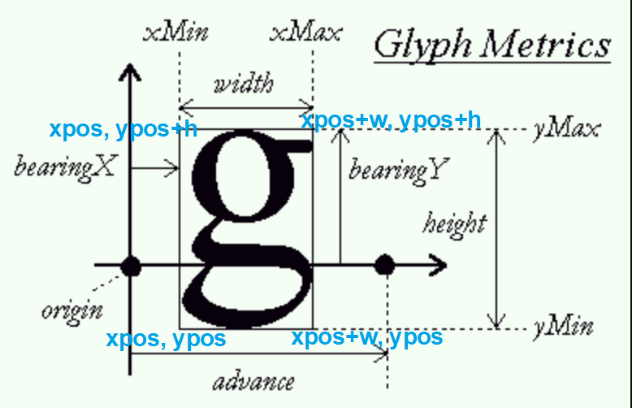

  ```c++
  GLfloat xpos = x + ch.Bearing.x * scale;
  GLfloat ypos = y - (ch.Size.y - ch.Bearing.y) * scale;
  
  GLfloat w = ch.Size.x * scale;
  GLfloat h = ch.Size.y * scale;
  // 对每个字符更新VBO
  GLfloat vertices[6][4] = {
      { xpos,     ypos + h,   0.0, 0.0 },            
      { xpos,     ypos,       0.0, 1.0 },
      { xpos + w, ypos,       1.0, 1.0 },
  
      { xpos,     ypos + h,   0.0, 0.0 },
      { xpos + w, ypos,       1.0, 1.0 },
      { xpos + w, ypos + h,   1.0, 0.0 }           
  };
  ```

  一些字符（如'p'或'q'）需要被渲染到基准线以下，因此字形四边形也应该被摆放在RenderText的y值以下。

  ```c++
  GLfloat ypos = y - (ch.Size.y - ch.Bearing.y);   
  ```

  **需要注意绘制的时候要开启混合**

  ```c++
  glEnable(GL_BLEND);
  glBlendFunc(GL_SRC_ALPHA, GL_ONE_MINUS_SRC_ALPHA); 
  ```

#### Fluid Simulation

使用的是**欧拉流体模拟方法**。欧拉方法的关键是将物理量标记在固定不变的空间位置上。

- 初始化网格（grid），每个像素对应的 cell 内存放着两种数据：密度（density） 和 速度（velocity）。

- 随机初始化速度场（每个速度有x, y方向）

  ```c++
  FOR_EACH_CELL{
  
  	float r = 10.0f;
  	old_velocity(x, y).x += randf(-r, +r);
  	old_velocity(x, y).y += randf(-r, +r);
  
  }
  ```

- 根据 density 增加 velocity 的 y 分量，模拟火焰烧得越旺的部分会往上延伸得越多。

  ```c++
  FOR_EACH_CELL{
  	old_velocity(x, y).y += (old_density(x, y) * 20.0f - 5.0f) * dt; 
  }
  ```

- 根据每个点到火焰中心的距离（火焰中心位置在函数调用的时候传入）计算出每一个点要增加的 density。使用 smoothstep 计算出 factor u，u 在 0、1 之间，与调用函数时传入的 value 相乘得到要增加的 density 的值。距离远的计算得到的值较小，距离近的值较大。

  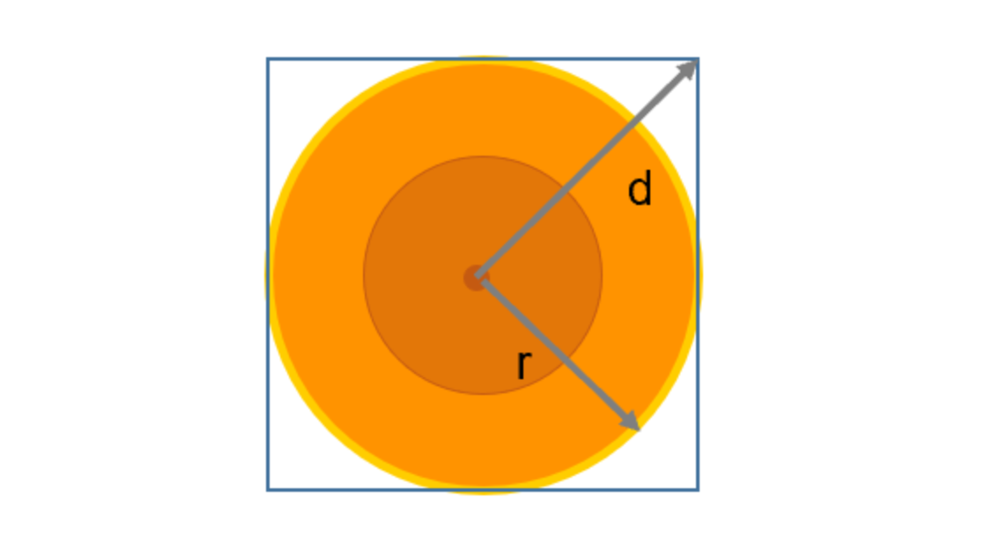

  ```c++
  void Fire::add_density(int px, int py, int r, float value) {
  	//std::cout << "in add density" << std::endl;
  	for (int y = -r; y <= r; y++) {
  		for (int x = -r; x <= r; x++) {
  			float d = sqrtf(x * x + y * y); // 计算距离
  			float u = smoothstep(float(r), 0.0f, d);  // Hermite interpolation
  			//cout << "u " << u << endl;
  			old_density(px + x, py + y) += u * value;
  		}
  	}
  }
  ```

- 涡度约束

  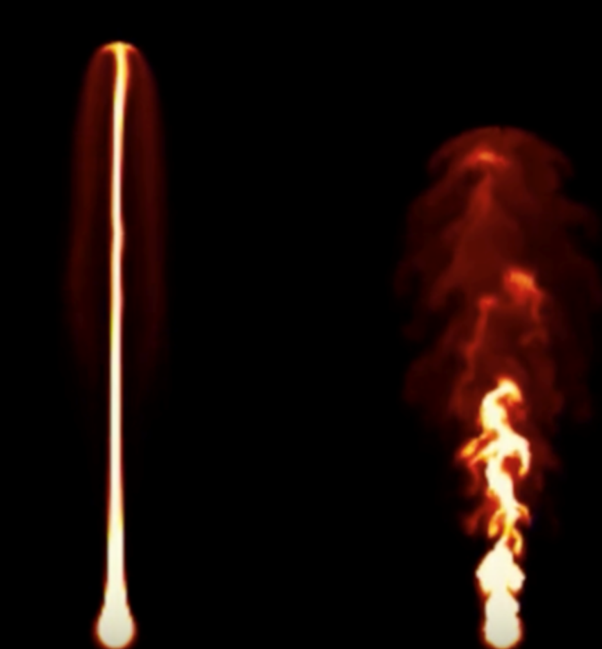

  进行涡度约束就会产生上图右侧火焰的效果。

  首先计算每个点的旋度

  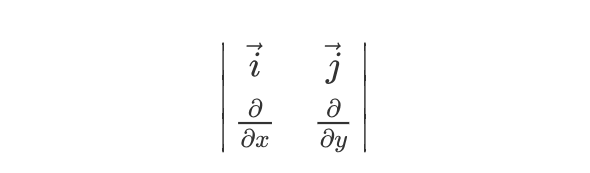

  ```c++
  float Fire::curl(int x, int y) {
  	return
  		old_velocity(x, y + 1).x - old_velocity(x, y - 1).x +
  		old_velocity(x - 1, y).y - old_velocity(x + 1, y).y;
  }
  ```

  使用计算出来的旋度进行涡度约束的计算

  ```c++
  void Fire::vorticity_confinement() {
  	//cout << "in vorticity" << endl;
  	Grid<float> abs_curl(nx, ny);
  
  	FOR_EACH_CELL{
  		abs_curl(x, y) = fabsf(curl(x, y));
  	}
  
  	FOR_EACH_CELL{
  		glm::vec2 direction;
  		direction.x = abs_curl(x + 0, y - 1) - abs_curl(x + 0, y + 1);
  		direction.y = abs_curl(x + 1, y + 0) - abs_curl(x - 1, y + 0);
  
  		direction = vorticity / (length(direction) + 1e-5f) * direction;
  
  		if (x < nx / 2) direction *= 0.0f;
  
  		new_velocity(x, y) = old_velocity(x, y) + dt * curl(x, y) * direction;
  
  	}
  
  	old_velocity.swap(new_velocity);
  }
  ```

- Advect velocity 对速度场做一个平流操作

  根据速度和delta t(时间)计算出旧的速度场的每个点在新的时间所到达的位置。 在新的位置做一个双线性插值得到 new velocity，储存在另一张 map 里面。

  ```c++
  void Fire::advect_velocity() {
  	FOR_EACH_CELL{
  		glm::vec2 pos = glm::vec2(x, y) - dt * old_velocity(x, y);
  		new_velocity(x, y) = interpolate(old_velocity, pos);
  	}
  
  	old_velocity.swap(new_velocity);
  }
  ```

- Project velocity 对速度场进行投影

  经过平流后速度场散度可能不为0，需要投影到一个散度为0的速度场。

  ```c++
  void Fire::project_velocity() {
  	Grid<float> p(nx, ny);
  	Grid<float> p2(nx, ny);
  	Grid<float> div(nx, ny);
  
  	FOR_EACH_CELL{
  		float dx = old_velocity(x + 1, y + 0).x - old_velocity(x - 1, y + 0).x;
  		float dy = old_velocity(x + 0, y + 1).y - old_velocity(x + 0, y - 1).y;
  		div(x, y) = dx + dy;
  		p(x, y) = 0.0f;
  	}
  
  	for (int k = 0; k < iterations; k++) {
  		FOR_EACH_CELL{
  			float sum = -div(x, y)
  				+ p(x + 1, y + 0)
  				+ p(x - 1, y + 0)
  				+ p(x + 0, y + 1)
  				+ p(x + 0, y - 1);
  			p2(x, y) = 0.25f * sum;
  		}
  
  		p.swap(p2);
  	}
  
  	FOR_EACH_CELL{
  		old_velocity(x, y).x -= 0.5f * (p(x + 1, y + 0) - p(x - 1, y + 0));
  		old_velocity(x, y).y -= 0.5f * (p(x + 0, y + 1) - p(x + 0, y - 1));
  
  	}
  }
  ```

- Advect density 对密度场进行平流操作

  与Advect velocity 类似，根据速度和delta t(时间)计算出旧的速度场的每个点在新的时间所到达的位置。 在新的位置做一个双线性插值得到 new density，储存在另一张 grid 里面。

  ```c++
  void Fire::advect_density() {
  	FOR_EACH_CELL{
  		glm::vec2 pos = glm::vec2(x, y) - dt * old_velocity(x, y);
  		new_density(x, y) = interpolate(old_density, pos);
  	}
  	old_density.swap(new_density);
  }
  ```

- 将 density 转换为 pixel

  ```c++
  FOR_EACH_CELL{
  	float rf = old_density(x, y);
  	float f = log2f(rf * 0.25f + 1.0f);
  	float f3 = f * f * f;
  	float r = 1.5f * f;
  	float g = 1.5f * f3;
  	float b = f3 * f3;
  
  	if (rf > 0.5f) {
  		pixels(x, y) = rgba(r, g, b, 1.0);
  		//cout << "rf " << rf << endl;
  	}
  	else { // 设置为透明
  		pixels(x, y) = rgba(r, g, b, 0.0);
  	}
  }
  ```

- 绘制

  ```c++
  glActiveTexture(GL_TEXTURE0);
  glBindTexture(GL_TEXTURE_2D, texture);
  glTexSubImage2D(GL_TEXTURE_2D, 0, 0, 0, nx, ny, GL_RGBA, GL_UNSIGNED_BYTE, pixels.data());
  
  fluidShader->setUniform("ourTexture", 0);
  
  glBindVertexArray(fireVAO);
  //cout << "draw" << endl;
  glDrawArrays(GL_TRIANGLES, 0, 6);
  ```

- 效果

  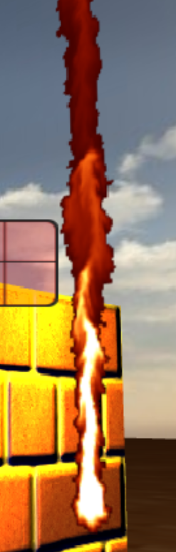

### 遇到的问题和解决方案

1. 各部件整合问题

   由于之前的火是在外部写的，所以一开始model矩阵没有设置好，导致火无法在迷宫里面显示。后来发现要先在迷宫的坐标系下表示出物件的位置，然后使用getModel函数（通过平移、旋转、缩放）得到model矩阵，再传入顶点着色器就可以解决问题了。

2. Blend 问题

   火焰放入迷宫之后无法与场景融合，第一个原因是储存火焰数据的grid里面的每一个cell里面的density在衰落之后（火焰熄灭之后）会变成黑色，值为0。所以设置了若density过于小则设置颜色r值为0，出现透明效果。另一个原因是没有开启blend，开启后即可解决。

   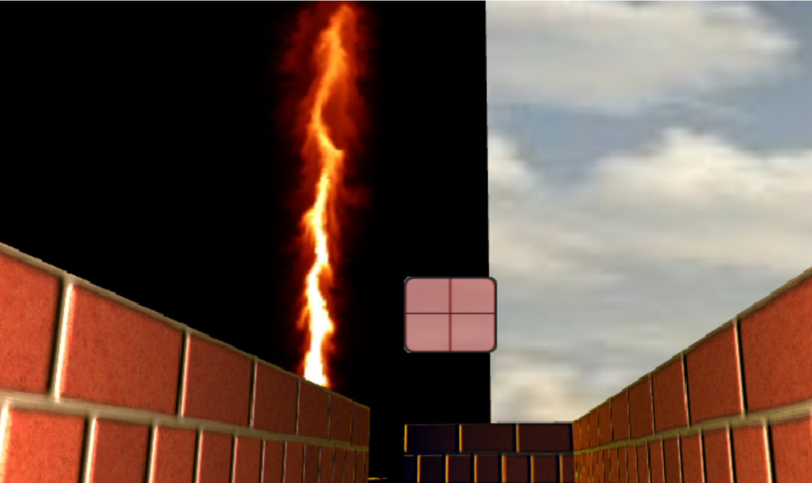

   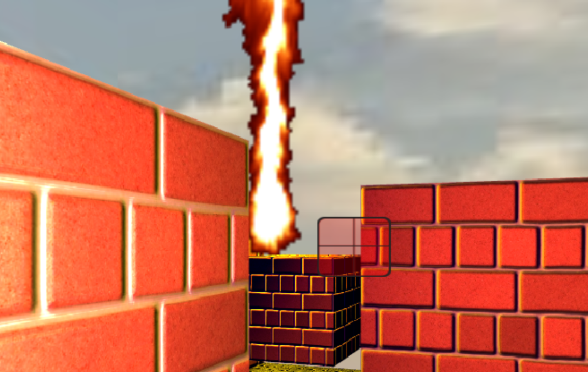

## 小组成员分工

| 组员   | 分工                                     |
| ------ | ---------------------------------------- |
| 王友坤 | 拟定项目题目，制作ppt                    |
| 王泽浩 | 负责法线贴图、枪及子弹的实现             |
| 黄紫菱 | 负责模型导入、粒子系统、天空盒、碰撞检测 |
| 王雁玲 | 流体模拟、字体显示、basic部分            |


