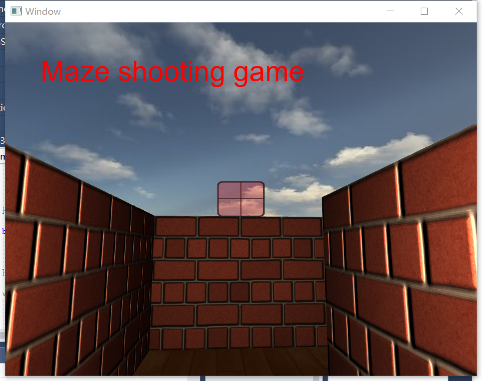
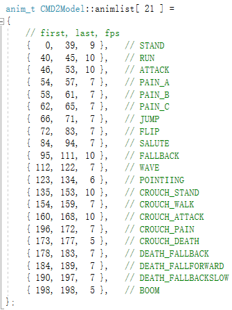

# 实验报告

## 项目介绍和实现结果


## 开发环境以及使用到的第三方库


## 实现功能列表

### Basic

1. Camera Roaming
2. Simple lighting and shading
3. Texture mapping
4. Shadow mapping
5. Model import& Mesh viewing

### Bonus

1. Sky Box
2. Display Text
3. Complex Lighting
4. Collision Detection
5. Particle System
6. Fluid Simulation

## 实现的功能点介绍

### Basic

#### Camera Roaming

#### Simple lighting and shading

1. 光照模型

   1. 新建了电光源这个类

   2. 环境光：

      ```c++
      ambientLight = lightColor * (intensity/4)
      ```

   3. 漫反射

      ```c++
      diffuseLight = vec3(dot(lightVector,NFragmentNormal))*lightColor*intensity/attenuation;
      ```

   4. 镜面反射

      ```c++
      reflected = reflect(-lightVector,NFragmentNormal);
      eyeDir = normalize(eyePos-NNFragmentPosition);
      spec = dot(reflected,eyeDir);
      specularLight = vec3(spec)*lightColor*intensity/attenuation;
      ```

   5. 光的衰弱

      ```c++
      0.2 +0.3 * lightDistance +0.4 * lightDistance * lightDistance;
      ```

      

#### Texture mapping

#### shadow mapping

#### model import & mesh viewing

1. md2model

   1. 顶点结构

      ```c++
      struct {  
      	BYTE vertex[3]; //顶点坐标 
      	BYTE normalIndex; //顶点的法向量
       }
      ```

   2. 每一帧的顶点解压

      ```c++
      x = 缩放比例 * v[0] + 偏移量 
      y = 缩放比例 * v[1] + 偏移量 
      z = 缩放比例 * v[2] + 偏移量
      normal = normalIndex;
      ```

      

### Bonus

#### sky box

1. 创建了立方体的类，类中包含
   1. GameObjectPtr cube：物体的最基本的类
   2. 立方体的顶点信息
   3. 立方体的面的信息
2. 创建了立方体纹理的类，类中包含
   1. 纹理的相关信息
   2. 绑定纹理信息的函数
3. 实现了天空盒的类，类中包含
   1. cube
   2. texturecube
   3. 构造函数
      1. 设置立方体的大小
      2. 将立方体的纹理贴图分别加入立方体纹理的类里面
   4. 设置着色器
      1. 顶点着色器：
         1. 将输入的位置向量作为片段着色器的纹理坐标
         2. 顶点位置=MVP*vec4(position,1)
      2. 片段着色器
         1. color = texture(skybox, TexCoord);
   5. 渲染
      1. 绑定纹理
      2. 渲染、绘制立方体



#### display text


#### complex lighting

#### collision detection

1. AABB碰撞
   1. 原理是判断两个物体的碰撞盒是否有重合的地方
   2. 即判断两物体的碰撞盒区域的pos的x和z分量是否是交叉的
2. 涉及的碰撞
   1. 角色和墙壁的碰撞
   2. 怪物和墙壁的碰撞
   3. 烟和墙壁的碰撞
   4. 子弹和怪物的碰撞
   5. 人和终点的碰撞
3. 优化
   1. 由于地图元素过多，对于碰撞问题需要检测很多次，这里使用了字符串数组存地图的方式，通过所在位置对应地图的字符串的值，判断是否在墙壁的区域来节省检测的时间
   2. 每次碰撞检测的时候都用现在的位置的x和z值访问字符串数组，获得该位置的情况，判断是否发生碰撞。

#### particle system

1. 实现了粒子类
   1. 粒子属性
      1. 运动方向
      2. 旋转
      3. 开始大小
      4. 最后大小
      5. 开始颜色
      6. 最后颜色
      7. 最大生命值
      8. 重力
      9. 纹理
   2. 更新函数
      1. 位置：随运动方向和重力作用影响
      2. 旋转角度：随旋转速度影响
      3. 大小：由开始大小到最后大小进行线性差值
      4. 颜色：由开始颜色到最后颜色进行线性差值
      5. 生命值减少
   3. 获取是否死亡
      1. 当生命值减到小于等于0时返回true
2. 实现粒子管理类
   1. 初始化：初始化粒子池的粒子、设置顶点数据、设置着色器
   2. 增加粒子：在获取闲置粒子，调用加入活跃池函数
   3. 更新函数
      1. 在活跃粒子池中寻找每一个粒子，将其纹理信息加到纹理库中
      2. 调用每个粒子的更新函数
      3. 判断当粒子死亡或者撞墙的时候，设置需要回收的粒子+1
   4. 回收函数
      1. 遍历活跃粒子池里的每一个粒子，当粒子处于死亡状态或者撞墙的时候，将后一个粒子的值赋给前一个粒子（即删掉这个粒子）
   5. 渲染函数
      1. 绑定纹理：确保第一个纹理单元时我们绑定的
      2. 设置着色器
      3. 绘出粒子
   6. 加入到活跃池
      1. 找到加入的粒子的索引
      2. 在该所引出插入这个粒子
      3. 活跃池粒子数+1
   7. 获取闲置粒子
      1. 取闲置池里最后一个粒子
      2. 从活跃池里选择应该被闲置的粒子

#### fluid simulation

#### Frame animation



#### bullet

#### Load Map

1. 这里使用了字符串数组存地图的方式
   1. 文件的格式
      1. 首先将地图的大小（x和y）填入第一行和第二行（这里直接设置了20和20）
      2. 第三行开始打地图，如果该处是墙壁就用“#”表示，如果是空的就用“ ” 表示
   2. 读取文件
      1. 先读取两行关于地图大小的信息
      2. 再按行读取，将字符存到字符串数组中
   3. 字符串数组转地图
      1. 遍历上一步获得的字符串数组，将字符串数组中为“#”的部分的位置 ($x_i$,1,$y_0$) 存到数组中，为“#”则存的位置是0
      2. 在渲染、绘制的过程中，将偏移值数组作为位置传入着色器中
      3. 模型的顶点着色器：在传入的位置+相应ID的偏移值作为真实的位置

## 遇到的问题和解决方案

1. 摄像机穿模
   1. 由于主角的碰撞盒小，因此当判断到与墙壁发生碰撞的时候，摄像机已经能看到模型内部的东西了
   2. 解决方案是在检测角色是否和墙壁碰撞的时候，讲主角的碰撞盒调大一些，
2. 碰撞检测所需时间过长
   1. 我们打算寻找能够缩短碰撞检测所需要的时间的方法，后来在别人的博客中看到了使用字符串记录地图信息，将字符串数组转换成地图，再通过字符串数组判断是否碰撞的想法，想到通过这种方法就能节省很多用来判断碰撞的时间，因此我们就参考了他的方法。虽然这么做准确度可能有点低，即不能精准到真实接触墙壁再
   2. 同时，在参考了这一想法后，我们也参考了他的文件组成，即，抽离出一些基本的类，例如mesh、几何图形等，而不是直接在处理一些逻辑问题例如碰撞、运动等的代码和处理顶点信息等放到同一个文件中，从而重构了代码结构。

## 小组成员分工

